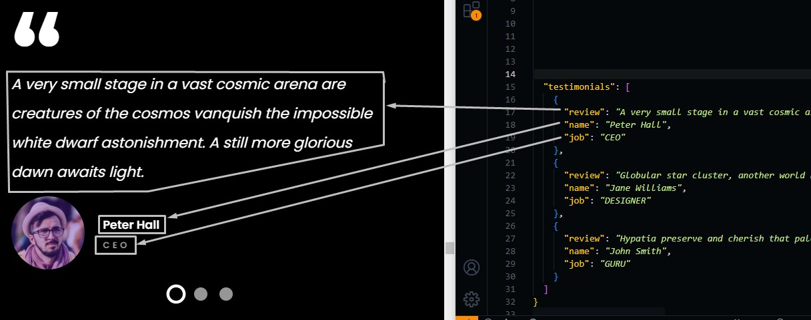

# Clients Section

Go to `./src/data/clients.json` file, and open it.

## Testimonials

You can change testimonails data from this file.

```json
 {
  "testimonials": [
    {
      "review": "review text",
      "name": "reviewer name",
      "job": "reviewer job title"
    },
    ...
  ]
}
```



You can also add or delete testimonails, as we explained in services section
