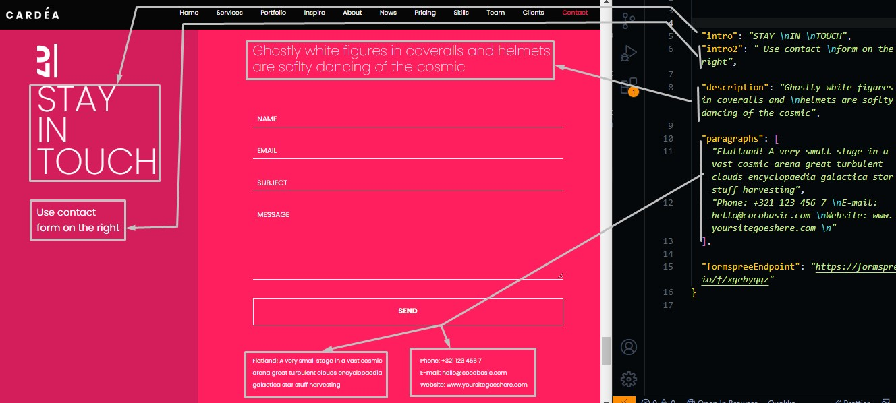
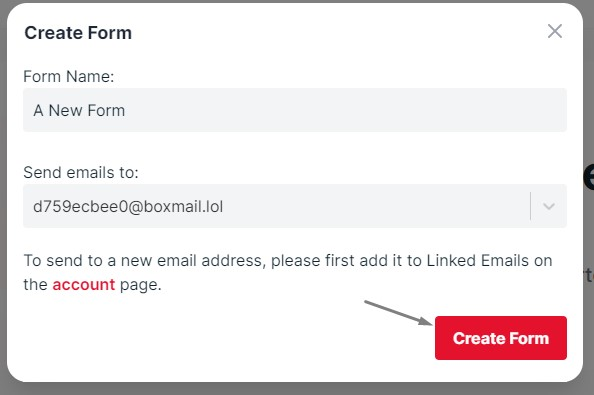
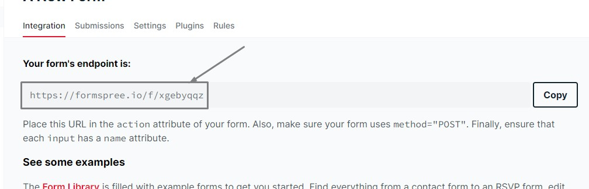
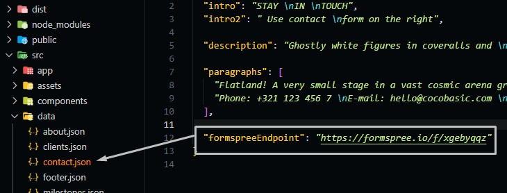

# Contact Section

Go to `./src/data/contact.json` file, and open it.

## Changing Contact Text

You can change the text that is existed in the contact section in need.

Here is the schema of the elements that you can change its value

```json
{
  "intro": "Introduction text in the sidebar",
  "intro2": "Introduction subtext in the sidebar",

  "description": "some text that describes the section",

  "paragraphs": [
    "text",
    ...
  ]
}
```



## Contact Form Activation

We used formspree API to receive messages via email, Make the following steps to activate the contact form and make messages sent to your email inbox.

- Goto [formspree](https://formspree.io/) and sign up with the email you want to receive messages on it.
- Activate your account and open your home page.
  
- Create a new form endpoint.
  
- Take Your endpoint from the website.
  
- Put your endpoint in `contact.json` file.
  
