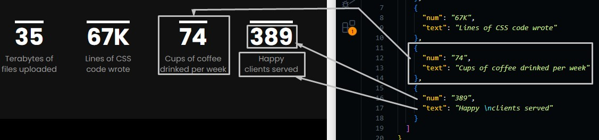

# Footer and Milestone

There are last two sections in the templates which are milesone and footer sections.

These sections are simple and don't have any complicated content

## Milestone Section

Go to `./src/data/milestones.json` file, and open it.

You will find the data of the text that is written in the section and you can change it in need.

```json
{
   "milestones": [
    {
      "num": "indicated value",
      "text": "milestone title"
    },
    ...
   ]
}
```



## Footer

Go to `./src/data/footer.json` file, and open it.

You will find the data of the text that is written in the footer and you can change easily.

```json
{
  // link to mail the author
  "mail": {
    "to": "mailto:hello@site.com", // were to go when clicking the link
    "text": "hello@cocobasic.com" // text to be shown
  },
  // link to phone the author
  "phone": {
    "to": "tel:987654321", // were to go when clicking the link
    "text": "987.654.321" // text to be shown
  },
  "info": "address information",
  // Author information
  "author": {
    "to": "http://cocobasic.com",
    "text": "CocoBasic"
  }
}
```


