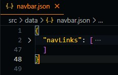
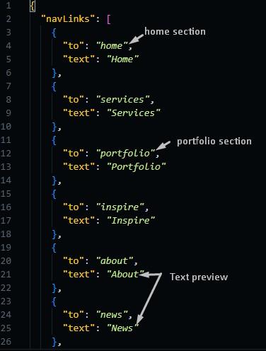
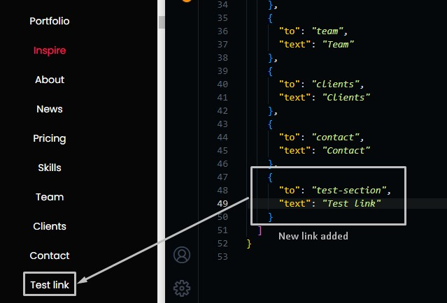

# Navigation Bar

We will learn how to edit navbar links, add and delete links too.

Go to `./src/data/navbar.json` file, and open it.

## Edit Links

To edit links text all you need to do is go to the data folder `./src/data` and open navbar.json file.

When you open this file you will find two large items,

- **navLinks** --> The navigation buttons



If you expanded navLinks you will find array of object each have these properties

```json
{
  "to": "section id to scroll to",
  "text": "text preview of the link"
}
```



## Add Links

To add links for example to nav links, you need to add another object and give it the given values.



## Delete Link

To delete a link you need to remove the object of the link you want to remove, for example, you can delete the links we added from the previous step.
