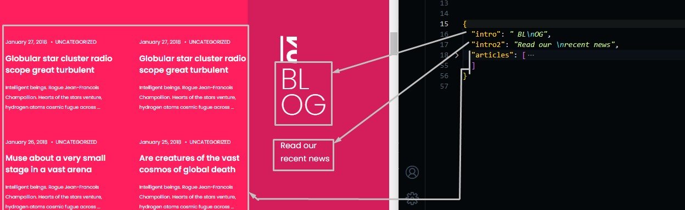
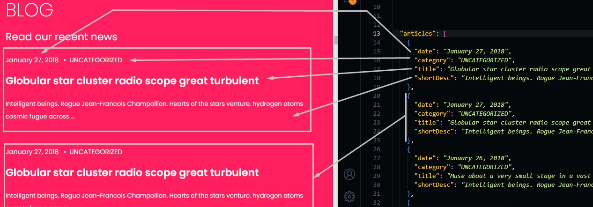

# News Section

Go to `./src/data/news.json` file, and open it.

## Changing Section Text

Change the text in the file and the preview text in the template will be changed.

```json
{
  "into": "Introduction text in the sidebar",
  "into2": "Introduction subtext in the sidebar",

  // Articles informations
  "articles": [
    {
      "date": "publish date",
      "category": "article category",
      "title": "article title",
      "shortDesc": "description text about this article"
    },
    ...
  ]
}
```



## Change Articles

You can change article information such as: title, date, description and category.

You can delete or add any number of articles as you want too, we discussed adding and deleting process in services section.


