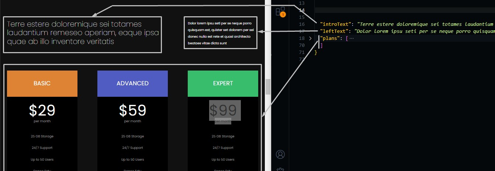
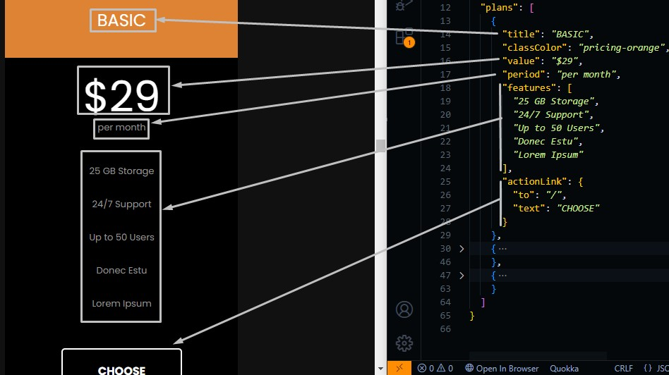

# Pricing section

Go to `./src/data/news.json` file, and open it.

## Changing Section Text

Change the text in the file and the preview text in the template will be changed.

```json
{
  "introText": "text",
  "leftText": "text",

  // Different Plans
  "plans": [ ... ]
}
```



## Pricing Plans

You can have at most 3 pricing plans, we made 3 different pricing plans.

Here is the schema of plan data.

```json
{
  "plans": [
     {
      "title": "plan title",
      // classColor should have one of the following values: [pricing-orange, pricing-blue, pricing-green]
      "classColor": "background color of the plan",
      "value": "plan value",
      "period": "service period",
      // Array of strings that descibes the features of the plan
      "features": [
        "text",
        "text",
        ...
      ],

      // The link to choose this plan
      "actionLink": {
        "to": "/", // were to go when clicking on the button
        "text": "CHOOSE" // text to be shown
      }
    },
    ...
  ]
}
```



You can change the plans number, or change plan information its fully customizable.
