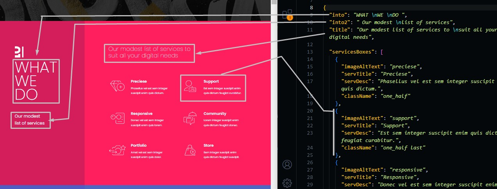
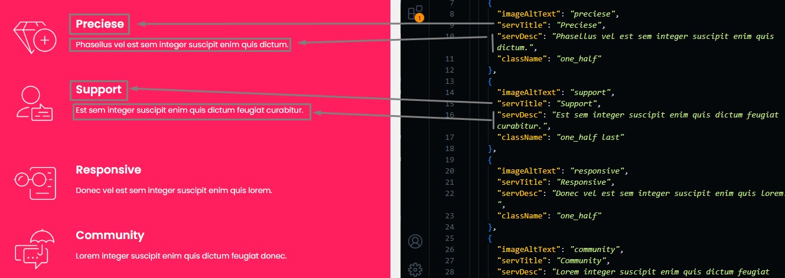
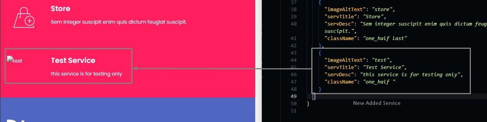
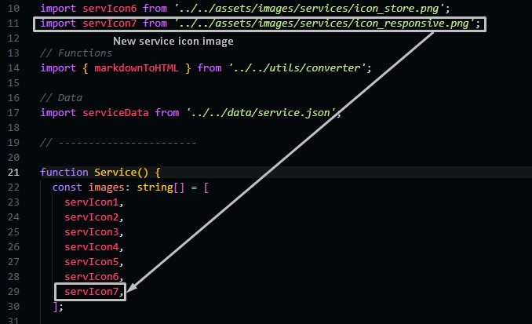

# Services Section

Go to `./src/data/services.json` file, and open it.

## Changing Section Text

Change the text in the file and the preview text in the template will be changed.

```json
{
  "into": "Introduction text in the sidebar",
  "into2": "Introduction subtext in the sidebar",
  "title": "section title (some random text to describe the section)",

  // Services you provide
  "servicesBoxes": [
    {
      "imageAltText": "Alt text of the image icon of the services (important in SEO)",
      "servTitle": "service title",
      "servDesc": "description of the service",
      "className": "developer parameter" // don't change this parameter
    },
    ...
  ]
}
```



:::info
`\n` means a breaklink in the text
:::

## Services Boxes

You can change service title or service description.
You can add or delete a service too.



### Adding Service

If you want to add a service, you need to copy one service Object in `services.json` file and add it to the servicesBoxes array, and here is an example.



:::info
className parameter value equals `one_half last` if you want the service to be in the second column
:::

As you can see in the image, the new service appeared but the problem is that there is no image.

go to `./src/pages/sections/Service.tsx` and add the new image.



:::info
Number of services should be equal the number of images in images array.
:::
