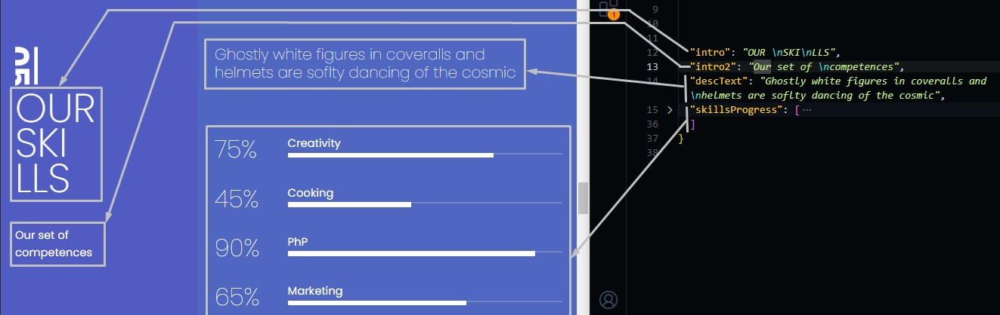
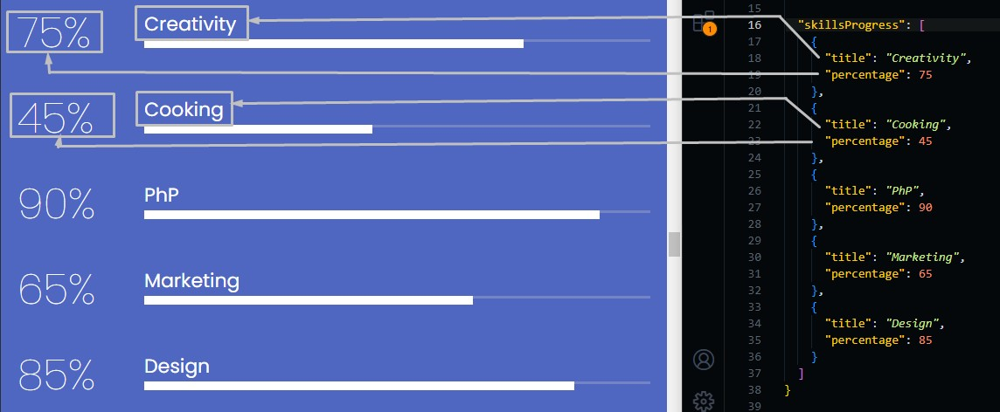

# Skills Section

Go to `./src/data/skills.json` file, and open it.

## Changing Section Text

Change the text in the file and the preview text in the template will be changed.

```json
{
  "intro": "Introduction text in the sidebar",
  "intro2": "Introduction subtext in the sidebar",
  "descText": "some text to describe the section",

  // Skills Progress
  "skillsProgress": [ ... ]
}
```



## Skills Progress

You can change skills progress part by the values you need.

Here is the schema of the values.

```json
{
  "skillsProgress": [
    {
      "title": "skill title",
      "percentage": "Your proficiency in this skill"
    },
    ...
  ]
}
```



You can delete or add skills as you want too, we discussed adding and deleting process in services section.
