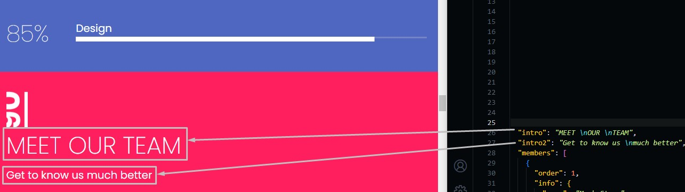
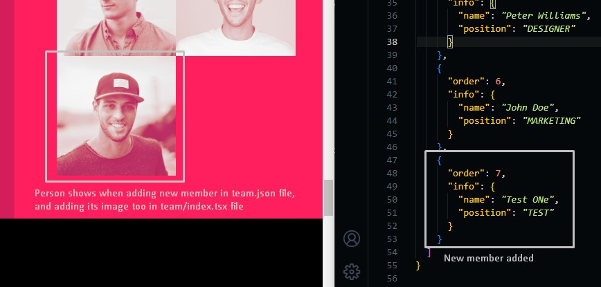
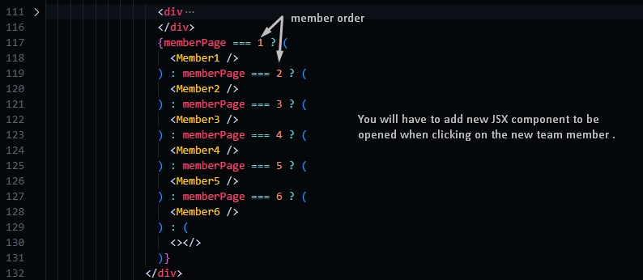
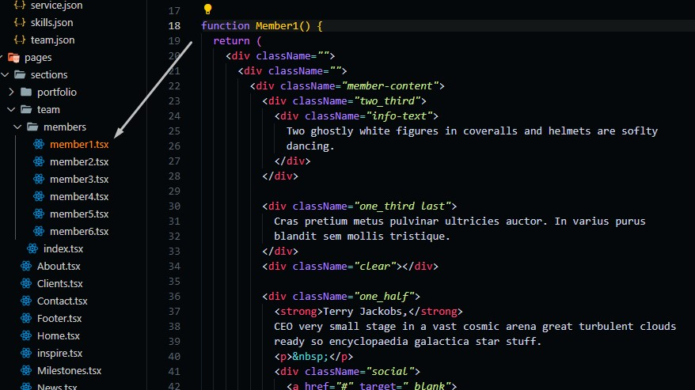

# Team Section

Go to `./src/data/team.json` file, and open it.

## Changing Section Text

Change the text in the file and the preview text in the template will be changed.

```json
{
  "intro": "Introduction text in the sidebar",
  "intro2": "Introduction subtext in the sidebar",

  "members": [
    {
      // member number, you should arrange them ascendingly
      "order": 1,

      // Team member information
      "info": {
        "name": "mebmer name",
        "position": "member job title"
      }
    },
    ...
  ]
}
```



## Changing Team Members

You can or delete team member as you need, but you will have to add its image before adding, as we explained in portfolio section.

### Adding new Member

In case you want to add new member you will have to make the member page that will be opened when clicking on the member image.

We explained how to do this before in portfolio section, case action/type == 'item'

After adding team member object and add its image too, as in the following image.


Then you need to make new JSX component to be opened when clicking on this new team member.


:::info
Adding new team member is kinda hard as in portfolio section too but we tried to make it clear to non-technical people
:::

## Member JSX Component

In `./members` you will find tsx files, each of them represents a jsx component to be rendered when clicking on a team member image.

If you want to edit those items you can go to one of them and edit the content of it.

:::info
These items can only be edited through their tsx file, and if you want to add new items (as we said in the Adding new member), you need to put the team member content you need, or you can use the template we used in one of the 6 team members that we have put as a demo.
:::


